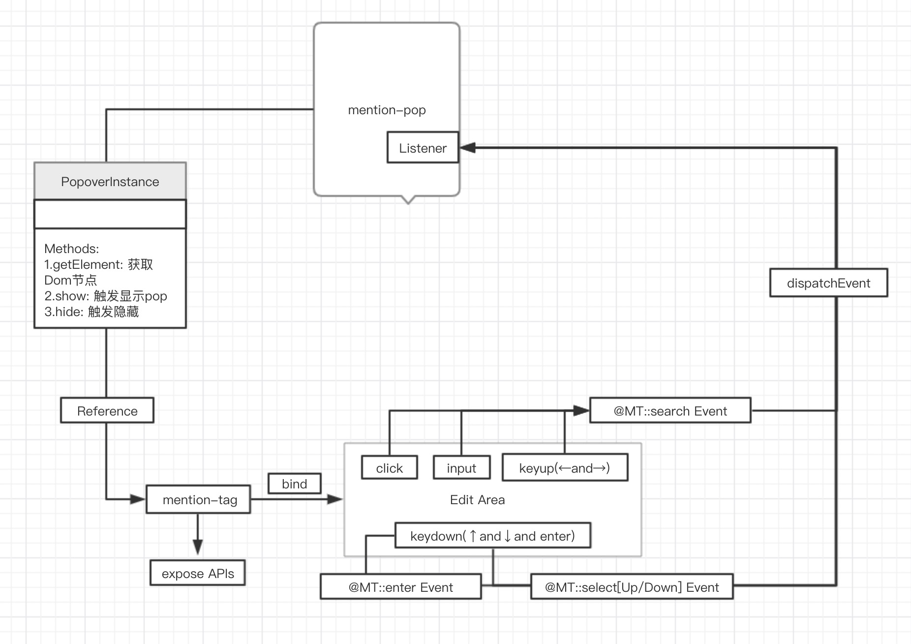

# edit-mention
> If you're looking for a complete solution，It is recommended that you can try to use the [draft-js](https://github.com/facebook/draft-js) and its plug-in system [draft-js-plugins](https://github.com/draft-js-plugins/draft-js-plugins)(about mention module).

## 整体思路

## 模块一： mention-pop 组件
> 提示弹出框选取组件
- [ ] 原生DOM实现
- [ ] 生成Vue组件，React组件，WebComponent组件
最终都是构造一个弹出框实例对象用于渲染及与mention-tag模块进行通信

## 模块二： mention-tag 模块
> 输入区标签插入控制模块
### mention taget
- [x] 适配可编辑元素(contenteditable=true)
- [ ] 适配HTMLTextAreaElement，HTMLInputElement封装元素(由于使用shadowdom封装无法获取到selection和Range只能通过元素暴露的方法进行操作)
### mention tag
- [x] 生成/插入 可直接删除的标签
- [ ] 可选择标签 是否 可直接删除

## DOC
